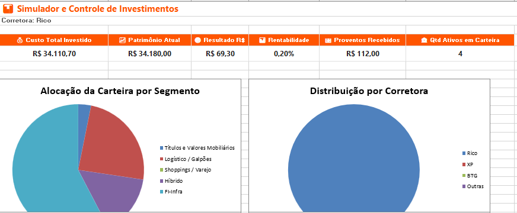
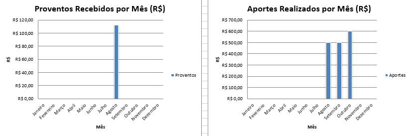
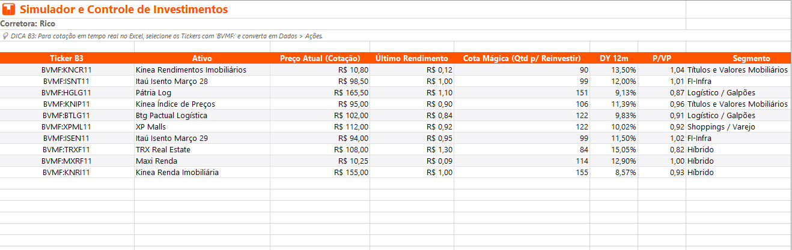

# 📊 Simulador e Controle de Investimentos (FIIs & FI-Infra)

Projeto desenvolvido como solução prática para o desafio **"Criando uma Ferramenta de Controle de Investimentos com Excel"**, parte da trilha do bootcamp **Santander - Excel com IA e Claude** na plataforma **DIO (Digital Innovation One)**.

---

## 📌 Sobre o Projeto

A ferramenta é uma planilha inteligente e automatizada voltada para a gestão e acompanhamento de carteiras de renda variável, com foco em **Fundos Imobiliários (FIIs)** e **FI-Infra**. 

A solução alia conceitos de modelagem financeira no Excel a prompts de Inteligência Artificial para estruturação de fórmulas avançadas, prototipagem de dados e aplicação de uma identidade visual baseada no padrão da **Corretora Rico**.

---

## 📸 Demonstração da Planilha

### 📊 Dashboard Principal

  

### 📈 Gráficos de Proventos e Aportes

  

### 📋 Base de Ativos e Cotas Mágicas

---

## 🎯 Principais Funcionalidades

* **Dashboard Consolidado:** Indicadores-chave (KPIs) de patrimônio total, rentabilidade em tempo real, proventos acumulados e gráficos de alocação por segmento e corretora.
* **Controle de Carteira:** Apuração de posições com cálculo automático de **Preço Médio (PM)** ajustado com taxas operacionais.
* **Gestão de Proventos:** Registros dinâmicos da renda passiva recebida mês a mês.
* **Simulador Efeito Bola de Neve:** Projeção patrimonial para até 60 meses considerando o reinvestimento de dividendos e aportes recorrentes.
* **Integração B3:** Padronização de tickers para suporte à atualização de cotações automáticas no Excel.

---

## 🛠️ Tecnologias e Recursos

* **Microsoft Excel:** Aplicação de funções (`PROCV`, `SOMASE`, `SE`), validação de dados e construção de gráficos dinâmicos.
* **Engenharia de Prompt (IA):** Apoio na criação das estruturas de cálculo e apoio estético.
* **Git & GitHub:** Documentação e versionamento do projeto.

---

## 📥 Como Baixar e Utilizar

1. Faça o download da planilha [clicando aqui](./Simulador_e_Controle_de_Investimentos_Rico.xlsx) ou navegando pelos arquivos do repositório.
2. Abra o arquivo no **Microsoft Excel** ou no **Google Planilhas**.
3. Registre suas movimentações na aba `CARTEIRA` para atualizar o Dashboard automaticamente.

---

## 🌐 Conecte-se Comigo

Desenvolvido por **Natália Baptista** 🚀  
- 💼 [LinkedIn](https://www.linkedin.com/in/nataliapastre-dev)
- 🐙 [GitHub](https://github.com/nataliapastre-dev)

Os dados de carteira utilizados no projeto são fictícios e têm finalidade exclusivamente demonstrativa.
